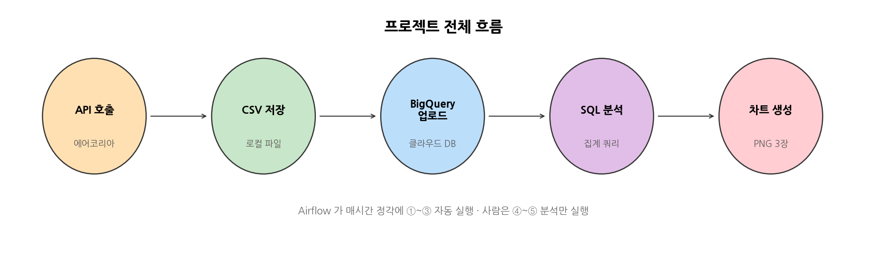
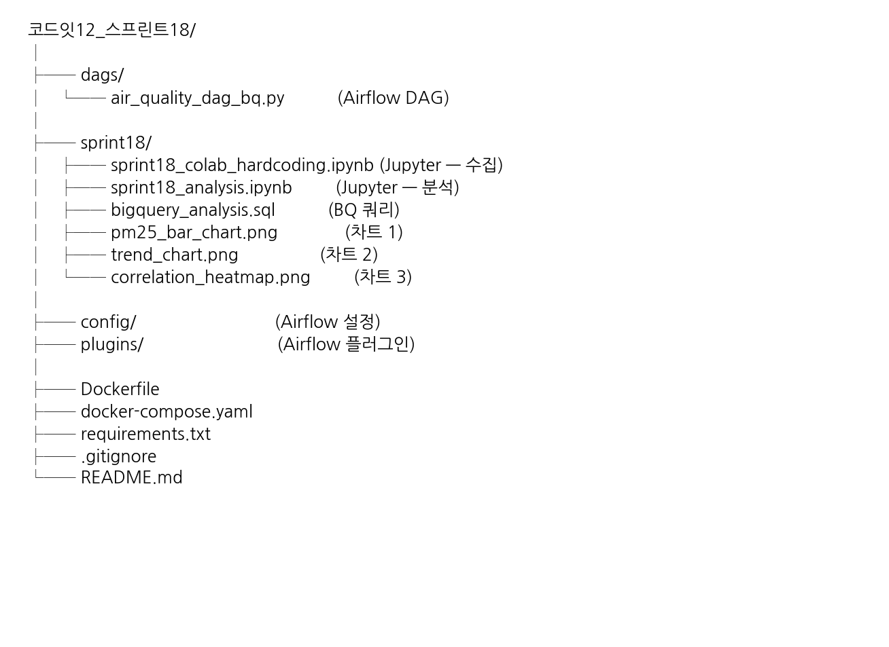
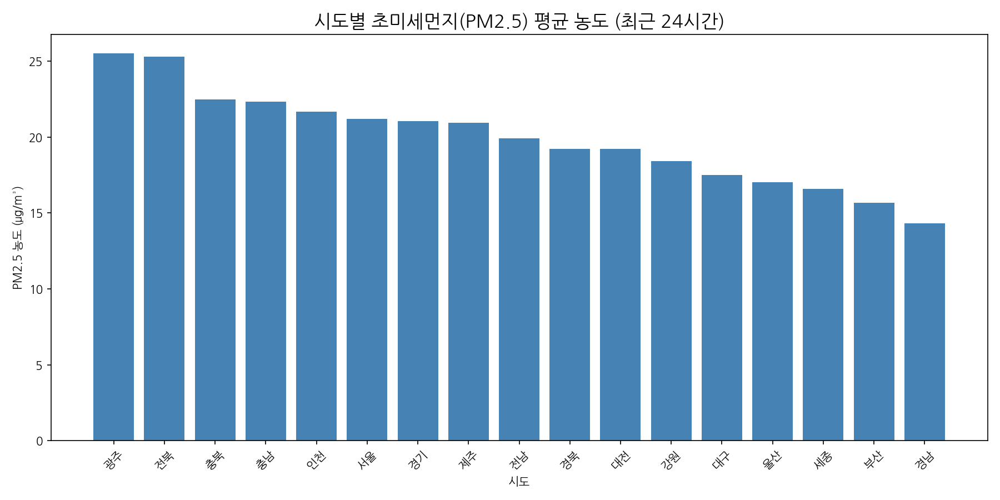
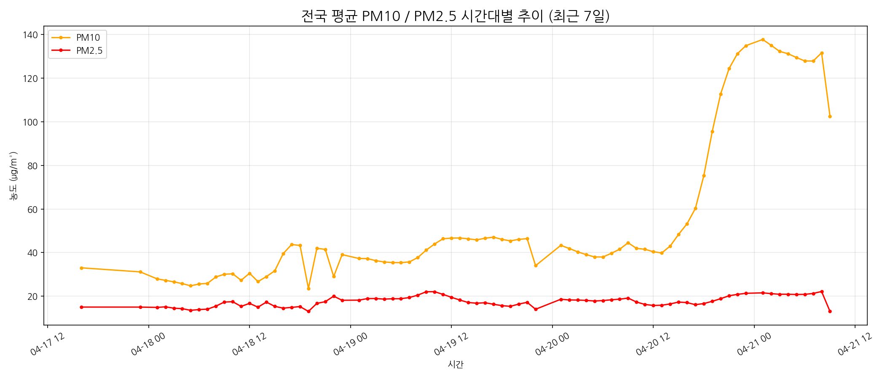
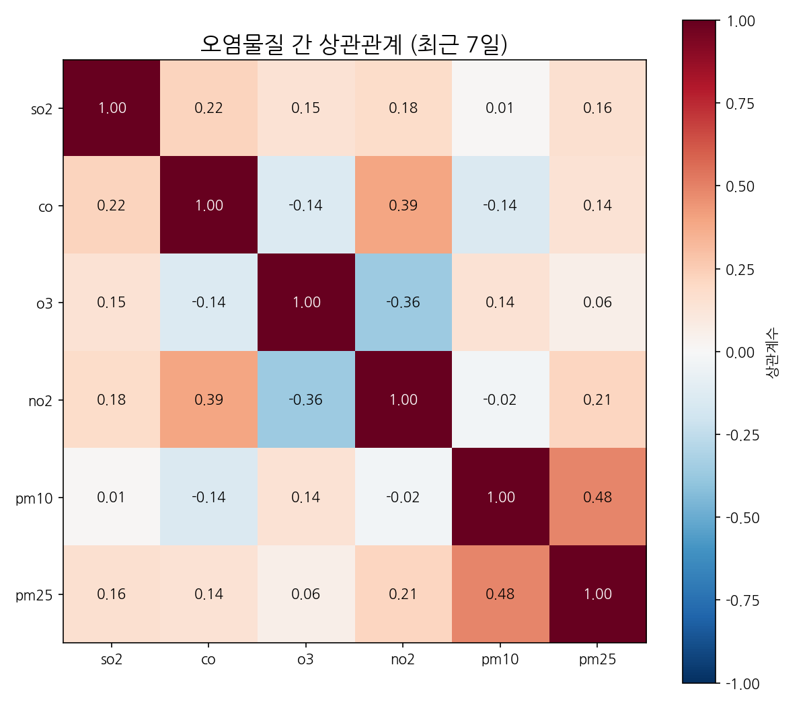

<div align="center">

# 에어코리아 대기오염 데이터 파이프라인

**매시간 전국 대기질 데이터를 자동으로 받아와 저장하고, 차트로 분석하는 프로젝트**

</div>

---

## 프로젝트 개요

한국환경공단 **대기오염 공개 API** 에서 전국 약 700개 측정소 데이터를 **매시간 자동 수집**.

수집 데이터는 **BigQuery** 에 누적 적재, **Jupyter 노트북**에서 SQL 로 조회·집계 → **차트 3장** 생성.

초기 셋업 이후에는 사람 개입 불필요. 자동으로 동작.

---

## 전체 흐름



1. Airflow 가 **매시간 정각**에 에어코리아 API 를 호출
2. 받은 데이터를 시간별 CSV 파일로 저장
3. 그 CSV 를 BigQuery 테이블에 덧붙이기 (기존 데이터 유지)
4. 필요할 때 Jupyter 노트북에서 BigQuery 조회 → SQL 로 집계
5. 집계 결과로 차트 3장 생성 (PNG 파일)

---

## 폴더 구조



---

## 사용한 도구

- **Apache Airflow** — "매시간 이거 실행해라" 같은 자동 스케줄링 담당. Docker 로 띄움
- **Google BigQuery** — 수십만 행도 SQL 로 몇 초 안에 집계되는 클라우드 데이터베이스
- **Python** — 데이터 처리(`pandas`), 시각화(`matplotlib`), API 호출(`requests`) 전부
- **Docker Compose** — Airflow 를 한 줄 명령어로 실행·종료하기 위한 도구

---

## 실행 순서

### 1. API 키 발급

[공공데이터포털](https://www.data.go.kr/) 회원가입 후 **한국환경공단 에어코리아 대기오염정보** 검색 → 활용신청. 승인 시 마이페이지에서 **Decoding 인증키** 복사.

### 2. API 주소 확인

프로젝트에서 사용하는 API 주소:

```
http://apis.data.go.kr/B552584/ArpltnInforInqireSvc/getCtprvnRltmMesureDnsty
```

공공데이터포털 "시도별 실시간 측정정보 조회" 엔드포인트.

<sub>
출처: 대기오염정보 기술문서 v1.3<br>
p.6<br>
Table 4 · API 서비스 개요
</sub>

### 3. 파라미터 확인

주요 파라미터 요약. `sidoName=전국` 지정 시 17개 시도 데이터를 **한 번의 호출로** 수신 → 호출 수 절약. `ver=1.3` 은 PM10·PM2.5 1시간 등급 자료 포함 버전.

<sub>
출처: 대기오염정보 기술문서 v1.3<br>
p.14~15<br>
Table 16 · 요청 메시지 명세
</sub>

**기술문서에서 확인한 기타 정보**

- **데이터 생성주기**: 서버가 데이터를 매시 15분 내외로 새로 채움. 따라서 정각보다 **매시 20분** 에 호출하면 가장 신선한 데이터를 받을 수 있음 (현 DAG 는 정각 호출 → 필요 시 `schedule_interval="20 * * * *"` 로 변경 가능)
    <sub>
    p.5<br>
    Table 3 · 데이터 생성주기
    </sub>

- **응답 필드**: stationName, dataTime, pm10Value, pm25Value, sidoName 등 총 35개 필드
    <sub>
    p.17<br>
    Table 17 · 응답 메시지 명세
    </sub>

- **API 한도**: 초당 최대 50 TPS, 평균 응답 500ms
    <sub>
    p.14<br>
    Table 15 · 상세기능정보
    </sub>

- **에러 코드**: `22`(서비스 요청 제한 횟수 초과 — 하루 트래픽), `30`(등록하지 않은 서비스키) 등
    <sub>
    p.26<br>
    Table 30
    </sub>

### 4. 구글 클라우드 설정

구글 클라우드 콘솔에서 **서비스 계정(Service Account)** 생성 → **BigQuery 관리자** 권한 부여 → **JSON 키 파일** 다운로드. 이 키가 "프로그램이 BigQuery 에 접속할 때 쓰는 비밀번호" 역할.

### 5. 라이브러리 추가

`requirements.txt` 에 필요 라이브러리 추가.

```
apache-airflow-providers-google
google-cloud-bigquery
pandas
requests
lxml
```

### 6. Airflow 실행

프로젝트 폴더에서 한 줄 명령으로 Airflow 기동.

```bash
docker compose up -d
```

브라우저에서 `http://localhost:8081` 접속. 아이디·비번 모두 `airflow`.

### 7. Airflow 에 비밀정보 등록

Airflow 웹 UI → **Admin → Variables** 에서 2개 등록.

- **SERVICE_API_KEY**: 1단계에서 복사한 공공데이터 인증키
- **GCP_SERVICE_ACCOUNT**: 4단계 JSON 파일 **전체 내용** 붙여넣기

### 8. DAG 실행

Airflow UI 에서 `sprint18_air_quality_bq` DAG 토글 ON → 매시간 정각 자동 실행. 수동 즉시 실행은 **Trigger DAG** 버튼.

---

## DAG 코드

`dags/air_quality_dag_bq.py` 전체. Task 2개 — **수집** · **적재**.

```python
import json
import os
from datetime import datetime, timezone, timedelta

import pandas as pd
import requests

from airflow import DAG
from airflow.models import Variable
from airflow.operators.python import PythonOperator
from google.cloud import bigquery
from google.oauth2 import service_account

# GCP / BigQuery 설정 (.env 에서 읽어옴, 없으면 기본값 사용)
GCP_PROJECT_ID = os.environ.get("GCP_PROJECT_ID", "your-gcp-project-id")
BQ_DATASET     = os.environ.get("BQ_DATASET_ID",  "codeit")
BQ_TABLE       = os.environ.get("BQ_TABLE_NAME",  "sprint18_air_quality")

# 에어코리아 API 주소
API_URL = "http://apis.data.go.kr/B552584/ArpltnInforInqireSvc/getCtprvnRltmMesureDnsty"

# CSV 저장 폴더 — 파일명은 실행 시각으로 동적 생성
DATA_DIR = "/opt/airflow/dags/data"


# Task 1: API 호출 → CSV 저장
def fetch_air_quality_data():

    api_key = Variable.get("SERVICE_API_KEY")

    params = {
        "serviceKey": api_key,
        "returnType": "xml",
        "numOfRows":  "1000",   # 전국 측정소 약 700개, 여유있게 설정
        "pageNo":     "1",
        "sidoName":   "전국",
        "ver":        "1.3",
    }

    # API 호출
    response = requests.get(API_URL, params=params, timeout=30)
    print(f"전국 호출 완료: status={response.status_code}")

    # pd.read_xml 으로 바로 DataFrame 변환
    df = pd.read_xml(response.content, xpath="//item")
    print(f"전국 측정소 수: {len(df)}건")

    # 수집 시각 컬럼 추가 — 9시간 추가하여 한국 시간대로 맞춤
    kst = timezone(timedelta(hours=9))
    now_kst = datetime.now(kst)
    df["collected_at"] = now_kst.strftime("%Y-%m-%d %H:%M:%S")

    # 시간별 CSV 파일 경로 생성 — 예: data/data_2026-04-21_15.csv
    os.makedirs(DATA_DIR, exist_ok=True)
    csv_path = f"{DATA_DIR}/data_{now_kst.strftime('%Y-%m-%d_%H')}.csv"

    # CSV 저장, 엑셀에서 확인 위해 utf-8-sig 로 인코딩
    df.to_csv(csv_path, index=False, encoding="utf-8-sig")


# Task 2: CSV → BigQuery 적재
def load_csv_to_bigquery():

    # 서비스 계정 정보 가져오기
    json_string  = Variable.get("GCP_SERVICE_ACCOUNT")
    service_info = json.loads(json_string)

    # 서비스 계정으로 인증 후 BigQuery 클라이언트 객체 생성
    credentials = service_account.Credentials.from_service_account_info(service_info)
    bq_client   = bigquery.Client(credentials=credentials, project=GCP_PROJECT_ID)

    # 적재할 테이블 경로: 프로젝트.데이터셋.테이블
    table_id = f"{GCP_PROJECT_ID}.{BQ_DATASET}.{BQ_TABLE}"

    # 적재 설정
    job_config = bigquery.LoadJobConfig(
        autodetect=True,                                           # 컬럼 타입 자동 감지
        source_format=bigquery.SourceFormat.CSV,                   # CSV 형식
        skip_leading_rows=1,                                       # 헤더 행 건너뜀
        write_disposition=bigquery.WriteDisposition.WRITE_APPEND,  # 기존 데이터 유지하고 추가
    )

    # Task 1 에서 저장한 CSV 경로 (같은 시각 기준 동일 파일)
    k_time = timezone(timedelta(hours=9))
    csv_path = f"{DATA_DIR}/data_{datetime.now(k_time).strftime('%Y-%m-%d_%H')}.csv"

    # 파일 열어서 BigQuery 에 업로드
    with open(csv_path, "rb") as csv_file:
        load_job = bq_client.load_table_from_file(csv_file, table_id, job_config=job_config)
        load_job.result()   # 업로드 완료까지 대기


# DAG 정의
with DAG(
    dag_id="sprint18_air_quality_bq",
    description="API 호출 → 로컬 CSV → BigQuery 적재",
    start_date=datetime(2025, 1, 1),
    schedule_interval="0 * * * *",   # 매시간 0분 실행
    catchup=False,
) as dag:

    task_fetch = PythonOperator(
        task_id="fetch_air_quality_data",
        python_callable=fetch_air_quality_data,
    )

    task_load = PythonOperator(
        task_id="load_csv_to_bigquery",
        python_callable=load_csv_to_bigquery,
    )

    task_fetch >> task_load
```

---

## 분석 노트북

`sprint18/` 폴더에 Jupyter 노트북 2개.

**sprint18_colab_hardcoding.ipynb** — API 호출부터 BigQuery 적재까지 **셀 단위 실습**용. Airflow 없이도 실행 가능, 학습용 적합.

**sprint18_analysis.ipynb** — BigQuery 데이터를 SQL 로 조회해 **차트 3장** 생성. 아래 결과물이 이 노트북 출력.

---

## 분석 결과

데이터 기간: **2026-04-17 ~ 2026-04-21** (약 4일, 52,416행, 672개 측정소)

### 시도별 PM2.5 평균 (최근 24시간)



* 17개 시도 모두 "보통" 등급(15~35 μg/m³) 안에 있어 **당장 경보가 울릴 지역은 없음**
* 최고 — **광주 25.5 · 전북 25.3** (서남권)
* 최저 — **경남 14.3 · 부산 15.7** (동남권 해안)
* **서남권이 동남권보다 미세먼지 농도가 높음**
* 수도권 (서울 21.2 · 경기 21.1 · 인천 21.7) 은 전국 평균 수준

### PM10 / PM2.5 시간대별 추이 (최근 7일)



* 대부분 기간은 평탄
* **04-20 오후부터 PM10 이 40 → 138 μg/m³ 로 3배 이상 급상승** (7일 최고점)
* 짧은 시간 급상승은 **황사처럼 외부에서 먼지가 대량 유입**될 때의 전형적 패턴
* 같은 시기 PM2.5 는 10~22 범위로 안정 → 이번 상승은 **굵은 입자 위주**
* 즉, 국내 배출원보다는 **외부 유입 요인**에 의한 대기악화

### 오염물질 간 상관관계 (최근 7일)



상관계수는 −1 에서 +1 사이 값. 양수면 "같이 오르내림", 음수면 "반대로 움직임".

* **PM10 ↔ PM2.5 = 0.48** — 가장 강한 양의 상관. 미세먼지끼리 **출처가 비슷해서** 같이 오르내림
* **CO ↔ NO2 = 0.39** — 둘 다 자동차 배기·화력발전 같은 **"뭔가를 태워서" 생기는 가스**라 동반 상승
* SO2 · CO 와 미세먼지의 상관은 약함 (0.01~0.16) — **미세먼지 발생 경로는 가스성 오염과 독립적**

---

> ## 유의 사항 — 보안
>
> ---
>
> **API 키 · 서비스 계정 JSON 은 절대 공개 저장소에 업로드 금지.**
>
> 한 번 커밋되면 Git 이력에서 완전 제거가 어려워 키 유출 위험이 큼. 사전에 `.gitignore` 로 차단 필수.
>
> ---
>
> **`.gitignore` 권장 내용**
>
> ```gitignore
> # GCP 인증 키
> *service_account*.json
> project-*.json
>
> # 환경변수
> .env
>
> # Airflow 런타임
> logs/
> dags/data/
> ```
>
> ---
>
> **커밋 전 체크**
>
> - `git status` 실행 시 `service_account_key.json`, `project-*.json`, `.env` 가 Untracked 목록에도 안 보여야 정상
> - 혹시 이미 커밋됐다면 `git rm --cached <파일>` 로 인덱스에서 제거 후 다시 커밋, 그리고 **해당 키는 즉시 폐기·재발급**

---

## 참고 문서

- [공공데이터포털](https://www.data.go.kr/)
- [한국환경공단 에어코리아 OpenAPI](https://www.data.go.kr/data/15073861/openapi.do)
- [Google Cloud BigQuery 문서](https://cloud.google.com/bigquery/docs)
- [Apache Airflow 공식 문서](https://airflow.apache.org/docs/)

---

<div align="center">

**코드잇 데이터 엔지니어링 스프린트 18**
_한국환경공단 에어코리아 OpenAPI 기반_

</div>
